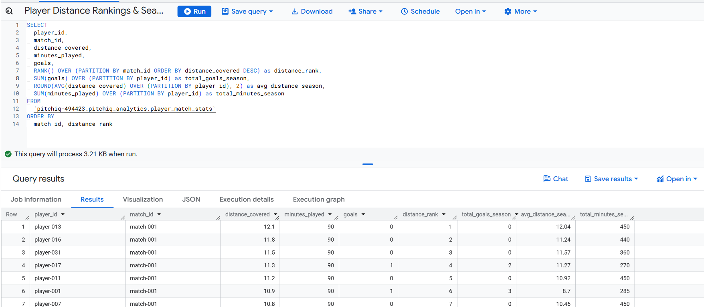
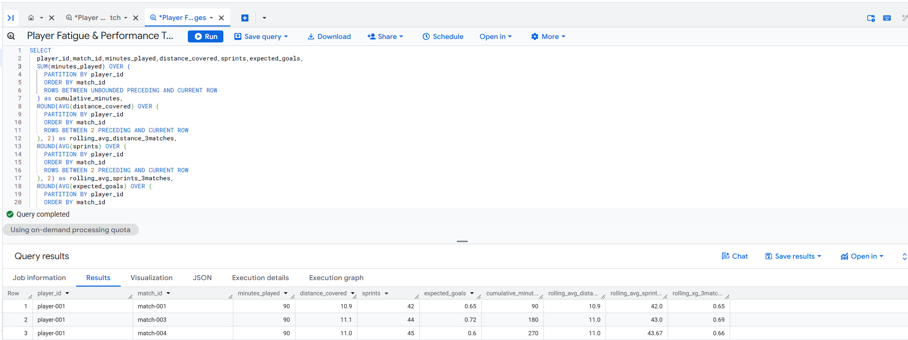

# PitchIQ

A football squad analytics platform built around one idea:
clubs should own their data, not rent access to it.

## Why I built this

I started looking into how professional football clubs actually handle performance data not the glamorous AI stuff, but the infrastructure underneath it. What I found was that most clubs are essentially renting their own data. It lives in vendor tools, gets built by analysts who eventually leave, and the club starts from scratch every season. As a developer, that felt like a solvable problem. So I built PitchIQ to see what a club-owned alternative could look like.

## What it does

PitchIQ ingests raw match performance data from external providers
(simulated in StatsBomb JSON format), runs it through a Python
ETL pipeline, stores it in a PostgreSQL database the club controls,
and serves it through a FastAPI analytics layer. A React dashboard
sits on top for visualization. The data persists. The queries
accumulate. The knowledge stays.

## Architecture

Raw JSON (StatsBomb-inspired format)
→ pipeline.py (extract → transform → load)
→ PostgreSQL / Supabase (club-owned storage)
→ FastAPI on GCP Cloud Run (API layer)
→ React on Netlify (dashboard)
→ BigQuery (analytical warehouse)

## The pipeline

`backend/app/data/pipeline.py` is the core of the project.

It does three things:

1. Reads raw JSON from a simulated provider feed
2. Transforms it — flattens nested structures, renames fields
   to match the schema, calculates derived values like match
   result and goals scored vs conceded from raw score objects
3. Loads into three normalized tables: matches,
   player_match_stats, team_match_stats

The extract step is intentionally decoupled. Swapping the JSON
file for a live Opta or StatsBomb API call requires changing
one function. Everything downstream stays the same.

## Why these tech choices

- **pandas** for transformation — straightforward for tabular
  data reshaping, and the skill most data engineers on football
  club teams actually use
- **Supabase** over a self-managed Postgres — faster to set up
  without sacrificing SQL access or ownership
- **FastAPI** over Django/Flask — async by default, automatic
  OpenAPI docs, Pydantic validation out of the box
- **GCP Cloud Run** over a VM — no server management, scales
  to zero when idle (important for free tier usage)
- **BigQuery** for the analytical layer — columnar storage makes
  window function queries across large datasets significantly
  faster than running them on the transactional database

## Known limitations

- Player data is simulated. The pipeline architecture is
  provider-agnostic but the extract layer currently reads
  from a local JSON file, not a live API
- No authentication on any endpoint. This is an MVP — adding
  auth would be the first production requirement
- The fatigue risk thresholds (400 minutes, 40 avg sprints)
  are hardcoded. In production these would be configurable
  per club
- BigQuery load is manual. A scheduled Cloud Function or
  Airflow DAG would automate this in a real setup

## BigQuery queries

Two window function queries are saved in the BigQuery Studio:

**Player Distance Rankings & Season Totals by Match**
— RANK() and SUM() OVER to rank players by distance within
each match and calculate season-wide totals


**Player Fatigue & Performance Trend Analysis**
— Rolling 3-match averages using ROWS BETWEEN 2 PRECEDING
AND CURRENT ROW to track distance, sprint, and xG trends
per player over time


## API

Base URL: `https://pitchiq-backend-787059661234.europe-west1.run.app`

| Endpoint                      | What it returns                                |
| ----------------------------- | ---------------------------------------------- |
| GET /api/players/performance  | Aggregated stats per player across all matches |
| GET /api/players/fatigue-risk | Players over workload thresholds with reasons  |
| GET /api/players/depth        | Player count per position                      |
| GET /api/matches/summary      | Match results with possession                  |
| GET /api/team/readiness       | Squad readiness score out of 100               |

Full docs: `/docs`

## Running locally

**Backend**

```bash
cd backend
python -m venv venv
venv\Scripts\activate        # Mac/Linux: source venv/bin/activate
pip install -r requirements.txt
cp .env.example .env         # fill in Supabase url and Supabase key
uvicorn app.main:app --reload --port 8001
```

**Frontend**

```bash
cd frontend
npm install
npm run dev                  # runs on localhost:5173
```

**Pipeline** (run from backend folder)

```bash
python -m app.data.pipeline
```

Note: pipeline.py truncates and reloads all three tables
on every run. Don't run it against production data without
checking first.

## Live

- Dashboard: https://pitchiqdata.netlify.app
- API: https://pitchiq-backend-787059661234.europe-west1.run.app
- API docs: https://pitchiq-backend-787059661234.europe-west1.run.app/docs
